# HotelNova

> Hotel reservation management system. Java 17 + JDBC + PostgreSQL (Neon).

This README will be expanded with full setup instructions, architecture
notes, screenshots and run instructions in a later commit.

For now: see `database/schema_postgres.sql` to provision the database
and `src/main/resources/database.properties.example` for connection setup.

## Class diagram

```mermaid
classDiagram
    direction LR

    %% =========== ENUMS ===========
    class UserRole {
        <<enumeration>>
        ADMIN
        RECEPTIONIST
    }
    class RoomType {
        <<enumeration>>
        SINGLE
        DOUBLE
        SUITE
    }
    class RoomStatus {
        <<enumeration>>
        AVAILABLE
        OCCUPIED
        MAINTENANCE
    }
    class ReservationStatus {
        <<enumeration>>
        PENDING
        ACTIVE
        COMPLETED
        CANCELLED
    }

    %% =========== ENTITIES ===========
    class User {
        -int id
        -String username
        -String passwordHash
        -UserRole role
        -String fullName
        -String email
        -boolean active
        -LocalDateTime createdAt
    }
    class Guest {
        -int id
        -String documentNumber
        -String firstName
        -String lastName
        -String phone
        -String email
        -boolean active
        +getFullName() String
    }
    class Room {
        -int id
        -String roomNumber
        -RoomType type
        -BigDecimal pricePerNight
        -RoomStatus status
    }
    class Reservation {
        -int id
        -int guestId
        -int roomId
        -int userId
        -LocalDate checkInDate
        -LocalDate checkOutDate
        -ReservationStatus status
        -BigDecimal totalCost
        +nights() long
    }

    %% =========== DAO INTERFACES ===========
    class GenericDao~T,ID~ {
        <<interface>>
        +save(T) T
        +findById(ID) Optional~T~
        +findAll() List~T~
        +update(T) boolean
        +deleteById(ID) boolean
    }
    class UserDao {
        <<interface>>
        +findByUsername(String) Optional~User~
    }
    class GuestDao {
        <<interface>>
        +findByDocumentNumber(String) Optional~Guest~
    }
    class RoomDao {
        <<interface>>
        +findByRoomNumber(String) Optional~Room~
        +findAvailable() List~Room~
        +updateStatus(int, RoomStatus) boolean
    }
    class ReservationDao {
        <<interface>>
        +countOverlapping(int, LocalDate, LocalDate) int
        +findByGuestId(int) List~Reservation~
        +findByStatus(ReservationStatus) List~Reservation~
        +save(Connection, Reservation) Reservation
    }

    %% =========== SERVICES ===========
    class AuthService {
        -UserDao userDao
        +login(String, String) User
    }
    class RoomService {
        -RoomDao roomDao
        +createRoom(Room) Room
        +findAvailable() List~Room~
    }
    class GuestService {
        -GuestDao guestDao
        +createGuest(Guest) Guest
        +deactivate(int) boolean
        +activate(int) boolean
    }
    class ReservationService {
        -ReservationDao reservationDao
        -RoomDao roomDao
        -GuestDao guestDao
        -BigDecimal iva
        +createReservation(...) Reservation
        +checkIn(int) void
        +checkOut(int) void
        +cancel(int) boolean
    }

    %% =========== VIEWS ===========
    class View {
        <<interface>>
        +showMessage(String) void
        +askString(String) String
        +askPassword(String) String
        +showMenu(String, String[]) int
    }
    class BaseView {
        <<abstract>>
        #formatUser(User) String
        #formatRoom(Room) String
        #formatGuest(Guest) String
        #formatReservation(Reservation) String
    }
    class ConsoleView
    class JOptionPaneView

    %% =========== EXCEPTIONS ===========
    class BusinessException {
        +BusinessException(String)
    }
    class DuplicateRoomNumberException
    class RoomNotAvailableException
    class InactiveGuestException
    class InvalidDateRangeException
    class OverlappingReservationException
    class CheckoutWithoutCheckinException
    class AuthenticationException
    class EntityNotFoundException

    %% =========== INHERITANCE ===========
    GenericDao <|-- UserDao
    GenericDao <|-- GuestDao
    GenericDao <|-- RoomDao
    GenericDao <|-- ReservationDao

    View <|.. BaseView
    BaseView <|-- ConsoleView
    BaseView <|-- JOptionPaneView

    BusinessException <|-- DuplicateRoomNumberException
    BusinessException <|-- RoomNotAvailableException
    BusinessException <|-- InactiveGuestException
    BusinessException <|-- InvalidDateRangeException
    BusinessException <|-- OverlappingReservationException
    BusinessException <|-- CheckoutWithoutCheckinException
    BusinessException <|-- AuthenticationException
    BusinessException <|-- EntityNotFoundException

    %% =========== COMPOSITION (services own their DAOs) ===========
    AuthService *-- UserDao
    RoomService *-- RoomDao
    GuestService *-- GuestDao
    ReservationService *-- ReservationDao
    ReservationService *-- RoomDao
    ReservationService *-- GuestDao

    %% =========== ASSOCIATIONS (entity relationships) ===========
    Reservation "0..*" --> "1" Guest : guest
    Reservation "0..*" --> "1" Room : room
    Reservation "0..*" --> "1" User : createdBy

    %% =========== DEPENDENCIES (use enums) ===========
    User ..> UserRole
    Room ..> RoomType
    Room ..> RoomStatus
    Reservation ..> ReservationStatus

    %% =========== SERVICES THROW EXCEPTIONS ===========
    RoomService ..> DuplicateRoomNumberException : throws
    GuestService ..> EntityNotFoundException : throws
    ReservationService ..> RoomNotAvailableException : throws
    ReservationService ..> InactiveGuestException : throws
    ReservationService ..> OverlappingReservationException : throws
    ReservationService ..> CheckoutWithoutCheckinException : throws
    ReservationService ..> InvalidDateRangeException : throws
    AuthService ..> AuthenticationException : throws
```

