# HotelNova — Hotel Reservation Management System

> Riwi M5.1 performance test — Java 17, JDBC, PostgreSQL (Neon), JOptionPane + Console UI.

A desktop application that manages hotel rooms, guests, system users and
reservations, with role-based login, transactional check-in / check-out,
business-rule validations, CSV reporting, and unit tests.

---

## Table of contents

1. [Requirements](#requirements)
2. [Class diagram](#Class diagram)
3. [Quick start](#quick-start)
4. [Project structure](#project-structure)
5. [Layered architecture](#layered-architecture)
6. [Business rules](#business-rules)
7. [JDBC transactions](#jdbc-transactions)
8. [Configuration](#configuration)
9. [Running the application](#running-the-application)
10. [Running the tests](#running-the-tests)
11. [Reports and logs](#reports-and-logs)
12. [Troubleshooting](#troubleshooting)

---

## Requirements

| Tool        | Version       |
| ----------- | ------------- |
| JDK         | 17 or higher  |
| Maven       | 3.8+          |
| PostgreSQL  | 14+ (Neon works) |

A free Neon account (https://neon.tech) is enough — no local DB required.

---

## Class diagram

```mermaid
classDiagram
    direction LR

    %% =========== ENUMS ===========
    class UserRole {
        <<enumeration>>
        ADMIN
        RECEPTIONIST
    }
    class RoomType {
        <<enumeration>>
        SINGLE
        DOUBLE
        SUITE
    }
    class RoomStatus {
        <<enumeration>>
        AVAILABLE
        OCCUPIED
        MAINTENANCE
    }
    class ReservationStatus {
        <<enumeration>>
        PENDING
        ACTIVE
        COMPLETED
        CANCELLED
    }

    %% =========== ENTITIES ===========
    class User {
        -int id
        -String username
        -String passwordHash
        -UserRole role
        -String fullName
        -String email
        -boolean active
        -LocalDateTime createdAt
    }
    class Guest {
        -int id
        -String documentNumber
        -String firstName
        -String lastName
        -String phone
        -String email
        -boolean active
        +getFullName() String
    }
    class Room {
        -int id
        -String roomNumber
        -RoomType type
        -BigDecimal pricePerNight
        -RoomStatus status
    }
    class Reservation {
        -int id
        -int guestId
        -int roomId
        -int userId
        -LocalDate checkInDate
        -LocalDate checkOutDate
        -ReservationStatus status
        -BigDecimal totalCost
        +nights() long
    }

    %% =========== DAO INTERFACES ===========
    class GenericDao~T,ID~ {
        <<interface>>
        +save(T) T
        +findById(ID) Optional~T~
        +findAll() List~T~
        +update(T) boolean
        +deleteById(ID) boolean
    }
    class UserDao {
        <<interface>>
        +findByUsername(String) Optional~User~
    }
    class GuestDao {
        <<interface>>
        +findByDocumentNumber(String) Optional~Guest~
    }
    class RoomDao {
        <<interface>>
        +findByRoomNumber(String) Optional~Room~
        +findAvailable() List~Room~
        +updateStatus(int, RoomStatus) boolean
    }
    class ReservationDao {
        <<interface>>
        +countOverlapping(int, LocalDate, LocalDate) int
        +findByGuestId(int) List~Reservation~
        +findByStatus(ReservationStatus) List~Reservation~
        +save(Connection, Reservation) Reservation
    }

    %% =========== SERVICES ===========
    class AuthService {
        -UserDao userDao
        +login(String, String) User
    }
    class RoomService {
        -RoomDao roomDao
        +createRoom(Room) Room
        +findAvailable() List~Room~
    }
    class GuestService {
        -GuestDao guestDao
        +createGuest(Guest) Guest
        +deactivate(int) boolean
        +activate(int) boolean
    }
    class ReservationService {
        -ReservationDao reservationDao
        -RoomDao roomDao
        -GuestDao guestDao
        -BigDecimal iva
        +createReservation(...) Reservation
        +checkIn(int) void
        +checkOut(int) void
        +cancel(int) boolean
    }

    %% =========== VIEWS ===========
    class View {
        <<interface>>
        +showMessage(String) void
        +askString(String) String
        +askPassword(String) String
        +showMenu(String, String[]) int
    }
    class BaseView {
        <<abstract>>
        #formatUser(User) String
        #formatRoom(Room) String
        #formatGuest(Guest) String
        #formatReservation(Reservation) String
    }
    class ConsoleView
    class JOptionPaneView

    %% =========== EXCEPTIONS ===========
    class BusinessException {
        +BusinessException(String)
    }
    class DuplicateRoomNumberException
    class RoomNotAvailableException
    class InactiveGuestException
    class InvalidDateRangeException
    class OverlappingReservationException
    class CheckoutWithoutCheckinException
    class AuthenticationException
    class EntityNotFoundException

    %% =========== INHERITANCE ===========
    GenericDao <|-- UserDao
    GenericDao <|-- GuestDao
    GenericDao <|-- RoomDao
    GenericDao <|-- ReservationDao

    View <|.. BaseView
    BaseView <|-- ConsoleView
    BaseView <|-- JOptionPaneView

    BusinessException <|-- DuplicateRoomNumberException
    BusinessException <|-- RoomNotAvailableException
    BusinessException <|-- InactiveGuestException
    BusinessException <|-- InvalidDateRangeException
    BusinessException <|-- OverlappingReservationException
    BusinessException <|-- CheckoutWithoutCheckinException
    BusinessException <|-- AuthenticationException
    BusinessException <|-- EntityNotFoundException

    %% =========== COMPOSITION (services own their DAOs) ===========
    AuthService *-- UserDao
    RoomService *-- RoomDao
    GuestService *-- GuestDao
    ReservationService *-- ReservationDao
    ReservationService *-- RoomDao
    ReservationService *-- GuestDao

    %% =========== ASSOCIATIONS (entity relationships) ===========
    Reservation "0..*" --> "1" Guest : guest
    Reservation "0..*" --> "1" Room : room
    Reservation "0..*" --> "1" User : createdBy

    %% =========== DEPENDENCIES (use enums) ===========
    User ..> UserRole
    Room ..> RoomType
    Room ..> RoomStatus
    Reservation ..> ReservationStatus

    %% =========== SERVICES THROW EXCEPTIONS ===========
    RoomService ..> DuplicateRoomNumberException : throws
    GuestService ..> EntityNotFoundException : throws
    ReservationService ..> RoomNotAvailableException : throws
    ReservationService ..> InactiveGuestException : throws
    ReservationService ..> OverlappingReservationException : throws
    ReservationService ..> CheckoutWithoutCheckinException : throws
    ReservationService ..> InvalidDateRangeException : throws
    AuthService ..> AuthenticationException : throws
```



---

## Quick start

1. **Clone the repository** and open the project in IntelliJ IDEA or NetBeans
   as a Maven project.

2. **Provision the database.** Create a project in Neon, open the SQL Editor,
   paste the contents of `database/schema_postgres.sql` and execute. This
   creates the four tables and seeds:
   - one administrator (`admin / admin123`)
   - four sample rooms
   - two sample guests

3. **Configure credentials.** Copy the template:

   ```bash
   cp src/main/resources/database.properties.example \
      src/main/resources/database.properties
   ```

   Open `database.properties` and replace the values with the JDBC URL and
   credentials that Neon shows under *Connection Details*. The URL must
   start with `jdbc:postgresql://`.

4. **Build and run:**

   ```bash
   mvn compile
   mvn exec:java
   ```

5. **Log in** with `admin / admin123`.

---

## Project structure

```
hotelnova/
├── database/
│   └── schema_postgres.sql      DDL + seed data, ready for Neon
├── src/
│   ├── main/
│   │   ├── java/com/luiscampillo/hotelnova/
│   │   │   ├── Main.java                 composition root
│   │   │   ├── config/                   AppConfig (singleton)
│   │   │   ├── db/                       ConnectionManager (singleton)
│   │   │   ├── model/
│   │   │   │   ├── entity/               User, Guest, Room, Reservation
│   │   │   │   └── enums/                UserRole, RoomType, RoomStatus, ReservationStatus
│   │   │   ├── exception/                BusinessException + 8 custom exceptions
│   │   │   ├── dao/                      interfaces
│   │   │   │   └── impl/                 JDBC implementations (template method)
│   │   │   ├── service/                  business rules + transactions
│   │   │   ├── controller/               menu orchestration per entity
│   │   │   ├── view/                     ConsoleView, JOptionPaneView
│   │   │   ├── report/                   CsvExporter
│   │   │   └── util/                     PasswordEncoder, DateValidator, CostCalculator, AppLogger
│   │   └── resources/
│   │       ├── app.properties
│   │       ├── database.properties.example     (versioned)
│   │       ├── database.properties             (git-ignored)
│   │       └── logging.properties
│   └── test/
│       └── java/com/luiscampillo/hotelnova/
│           ├── service/                  AuthServiceTest, RoomServiceTest, ReservationServiceTest
│           └── util/                     PasswordEncoderTest, CostCalculatorTest, DateValidatorTest
├── pom.xml
├── .gitignore
└── README.md
```

---

## Layered architecture

```
   View (ConsoleView | JOptionPaneView)
        │   knows only the View interface
        ▼
   Controller (Auth, Room, Guest, Reservation, Report)
        │   reads input from view, delegates to service
        ▼
   Service (Auth, Room, Guest, Reservation)
        │   enforces business rules, owns JDBC transactions
        ▼
   DAO (UserDao, GuestDao, RoomDao, ReservationDao)
        │   pure SQL via PreparedStatement, try-with-resources
        ▼
   PostgreSQL (Neon)
```

**Key decoupling guarantees:**

- Views never import `java.sql.*`. They only know `View`.
- Controllers never import `java.sql.*`. They only know their service.
- DAOs never know about views or controllers.
- The `View` interface has two implementations (`ConsoleView`,
  `JOptionPaneView`) selected at runtime via `app.properties → view.type`.

---

## Business rules

The seven rules required by the rubric are mapped to specific services and
exceptions. Every rule has at least one unit test.

| ID  | Rule                                              | Where it lives                            | Exception                                | Test |
| --- | ------------------------------------------------- | ----------------------------------------- | ---------------------------------------- | ---- |
| R1  | Unique room number                                | `RoomService.createRoom`                  | `DuplicateRoomNumberException`           | `RoomServiceTest` |
| R2  | Room must be AVAILABLE                            | `ReservationService.createReservation`    | `RoomNotAvailableException`              | `ReservationServiceTest` |
| R3  | Guest must be active                              | `ReservationService.createReservation`    | `InactiveGuestException`                 | `ReservationServiceTest` |
| R4  | Check-in < check-out, no past dates               | `DateValidator.validateReservationDates`  | `InvalidDateRangeException`              | `DateValidatorTest` |
| R5  | No overlapping reservation on the same room       | `ReservationService.createReservation`    | `OverlappingReservationException`        | `ReservationServiceTest` |
| R6  | Check-out only on ACTIVE reservation              | `ReservationService.checkOut`             | `CheckoutWithoutCheckinException`        | `ReservationServiceTest` |
| R7  | total = nights × pricePerNight × (1 + IVA)        | `CostCalculator.compute`                  | (n/a — pure function)                    | `CostCalculatorTest` |

**Overlap query (R5):**

```sql
SELECT COUNT(*) FROM reservations
WHERE room_id = ?
  AND status IN ('PENDING', 'ACTIVE')
  AND check_in_date < ?    -- new check_out
  AND check_out_date > ?   -- new check_in
```

Two date-range intervals overlap iff `a.start < b.end AND b.start < a.end`.

---

## JDBC transactions

Three operations span more than one SQL statement and run inside an
explicit transaction (`setAutoCommit(false)` + `commit()` / `rollback()`):

| Operation                    | Statements                                             |
| ---------------------------- | ------------------------------------------------------ |
| `createReservation`          | `INSERT reservations`                                  |
| `checkIn`                    | `UPDATE reservations` + `UPDATE rooms (status=OCCUPIED)`  |
| `checkOut`                   | `UPDATE reservations` + `UPDATE rooms (status=AVAILABLE)` |

Pattern used in every transactional method:

```java
try (Connection conn = cm.getConnection(false)) {
    try {
        // ... two or more DAO calls reusing 'conn' ...
        conn.commit();
    } catch (RuntimeException ex) {
        safeRollback(conn, "operationName");
        throw ex;
    }
}
```

Both DAOs taking part in the transaction expose overloaded methods that
accept the caller-supplied `Connection`, so the same transaction wraps
both updates.

---

## Configuration

Two property files live in `src/main/resources`:

**`app.properties`** (versioned, business config):

```properties
view.type=swing               # swing | console
business.iva=0.19             # 19% Colombian IVA
reports.directory=./reports/
logging.file=./app.log
```

**`database.properties`** (git-ignored, secrets):

```properties
db.url=jdbc:postgresql://ep-xxxx.us-east-2.aws.neon.tech/neondb?sslmode=require
db.user=neondb_owner
db.password=...
db.driver=org.postgresql.Driver
```

A template `database.properties.example` is committed so other developers
know which keys to provide.

---

## Running the application

**With Maven:**

```bash
mvn compile
mvn exec:java
```

**From an IDE:** run `Main.java` directly. Make sure the working directory
is the project root so `app.log` and `reports/` are created in the right
place.

**Switch UI mode:** edit `app.properties → view.type = console` and restart.

**Default credentials seeded by the schema:** `admin / admin123`
(the SHA-256 hash in the seed corresponds exactly to the Java
`PasswordEncoder.hash("admin123")`).

---

## Running the tests

```bash
mvn test
```

Tests use **JUnit 5** for the framework and **Mockito** to stub DAOs, so
no real database is required to run the suite.

| Test class                  | Coverage                                              |
| --------------------------- | ----------------------------------------------------- |
| `PasswordEncoderTest`       | SHA-256 determinism, known-vector check, null guard   |
| `CostCalculatorTest`        | R7 formula, edge cases, BigDecimal precision          |
| `DateValidatorTest`         | R4 — every invalid combination is rejected            |
| `AuthServiceTest`           | login happy path + 3 failure modes                    |
| `RoomServiceTest`           | R1 — duplicated room number                           |
| `ReservationServiceTest`    | R2, R3, R5, R6 + transactional commit verification    |

---

## Reports and logs

**CSV reports** are written to `reports/` (auto-created on first run):

- `rooms_YYYYMMDD_HHmmss.csv` — full room listing
- `active_reservations_YYYYMMDD_HHmmss.csv` — reservations in `ACTIVE` status

Field escaping follows RFC 4180: any value containing comma, quote or newline
is double-quoted and embedded quotes are doubled.

**Logs** are written to `app.log` (rotated, 1 MB per file, 5 files kept) and
also echoed to the console. Configuration in `logging.properties`. Format:

```
2026-04-27 14:35:02  [INFO   ] com.luiscampillo.hotelnova.Main - HotelNova v1.0.0 starting up
```

---

## Troubleshooting

**`Connection refused` or `SSL required`**
The Neon URL must include `?sslmode=require` and start with
`jdbc:postgresql://`. The PostgreSQL driver is auto-loaded at startup.

**`relation "users" does not exist`**
Re-run `database/schema_postgres.sql` against the Neon project.
The script creates the tables in dependency order.

**`Login failed: Invalid credentials` for the seeded admin**
Make sure `database.properties` points to the database where you ran the
schema. Verify the seed succeeded with `SELECT COUNT(*) FROM users` (must
return at least 1).

**`view.type` does not change the UI**
Both `app.properties` and `database.properties` must sit on the classpath
(`src/main/resources`). After editing either file, recompile so they are
copied into `target/classes`.

**Tests fail to discover**
Surefire 3.x is required for JUnit 5. The `pom.xml` already pins it.

---
